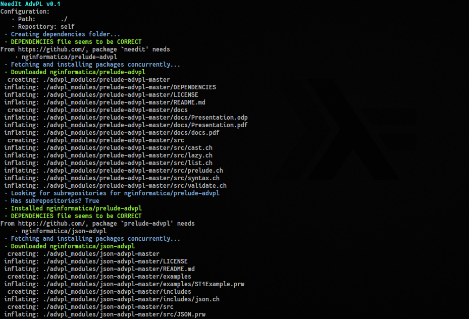

# NeedIt

> The awesome package manager for AdvPL!

NeedIt is a fast and simple and concise package manager for TOTVS AdvPL written in Haskell with support for submodules. It is made to run concurrently with a big focus on performance. Transform your applications in libraries and host them on Github. Import them and compile on your environment!

## Usage

`needit`

It'll look for a `DEPENDENCIES` file on your root and install its packages



## Meta-syntax

NeedIt provides a small DSL to create your packages, like:

```haskell
PACKAGE example
FROM https://github.com/

NEEDS nginformatica/prelude-advpl
NEEDS nginformatica/advpl-string-builder
NEEDS nginformatica/json-advpl
```

You can also use the module `NeedIt.hs` to write your own integration.
